# 📊 Data Analyser

**Open a file. Understand your data.**

Data Analyser is a Django web app that turns a raw CSV, Excel or JSON file into a clear, printable analysis report: structure, missing values, duplicates, statistics, outliers and automatic data-quality warnings, all in one click.


---

## 📸 Screenshots

### Landing & Workspace

| Landing page | Workspace |
|---|---|
| 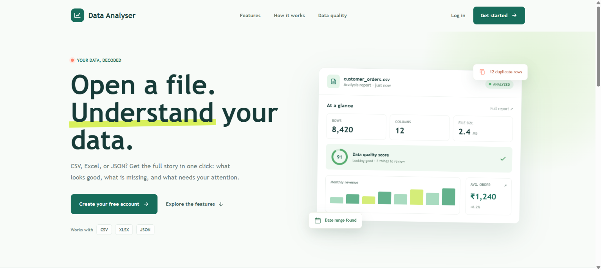 | 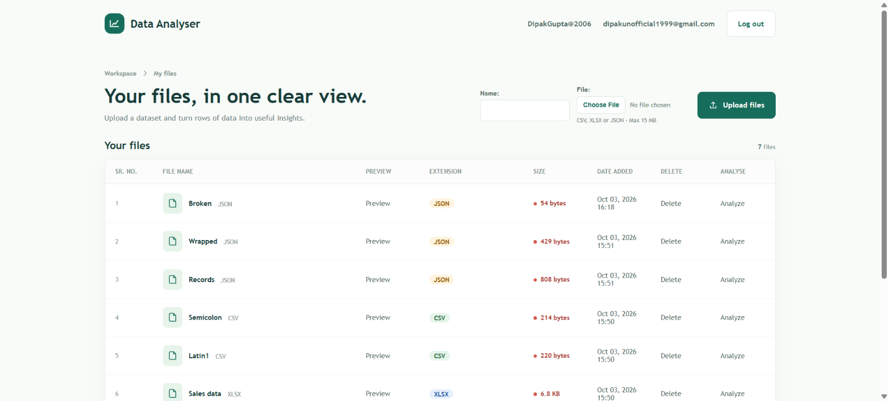 |

### Data Preview

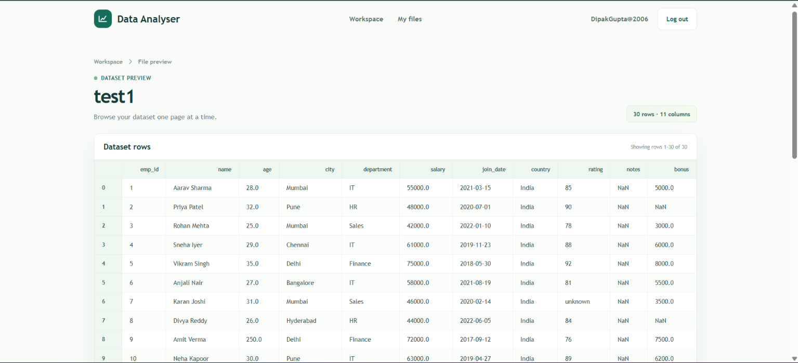

### Analysis Report

**Overview**

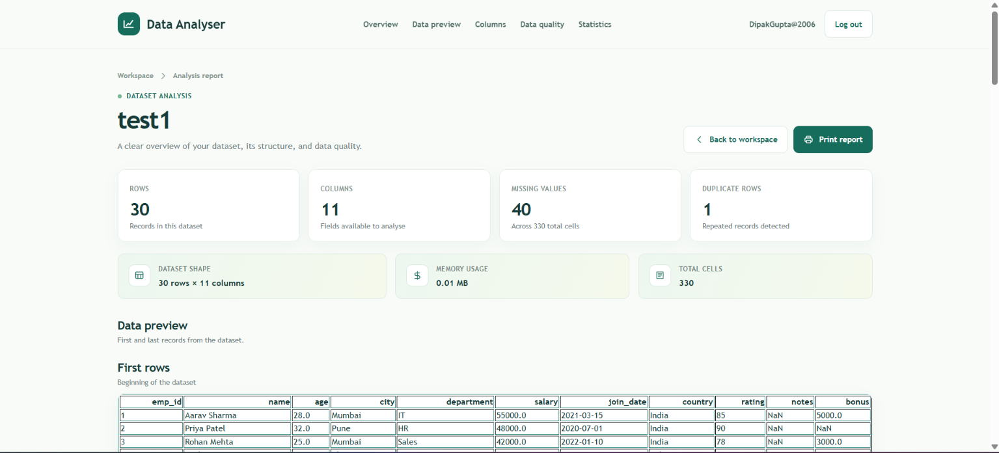

| Data preview (first & last rows) | Columns |
|---|---|
| 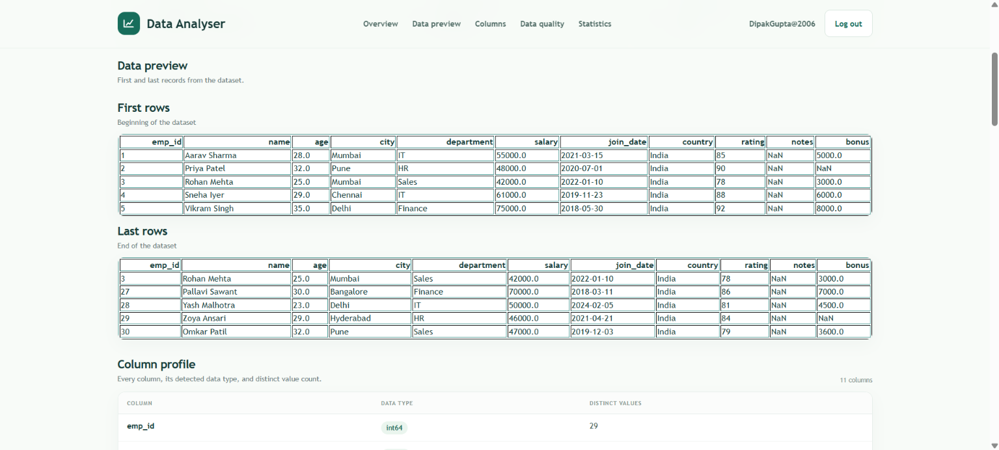 | 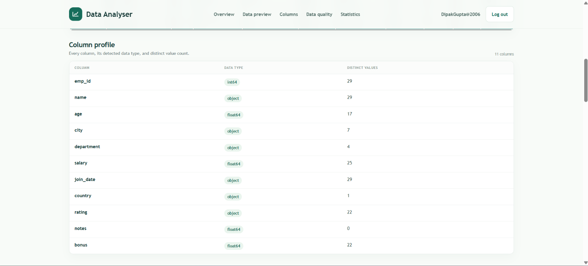 |

| Missing values | Numeric statistics & correlation |
|---|---|
| 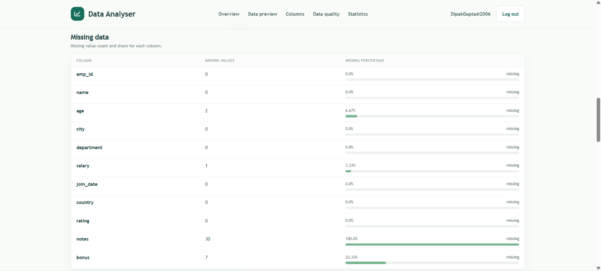 | 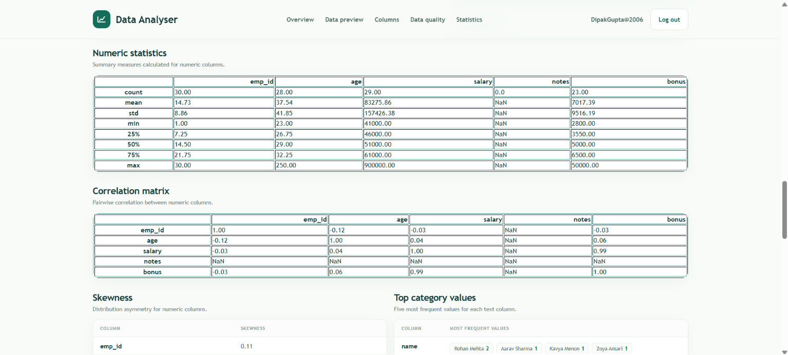 |

| Skewness & top categories | Outliers, datetime & duplicates |
|---|---|
| 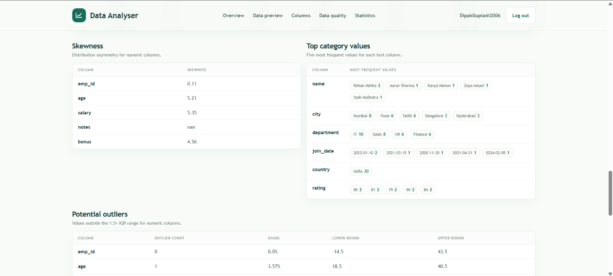 | 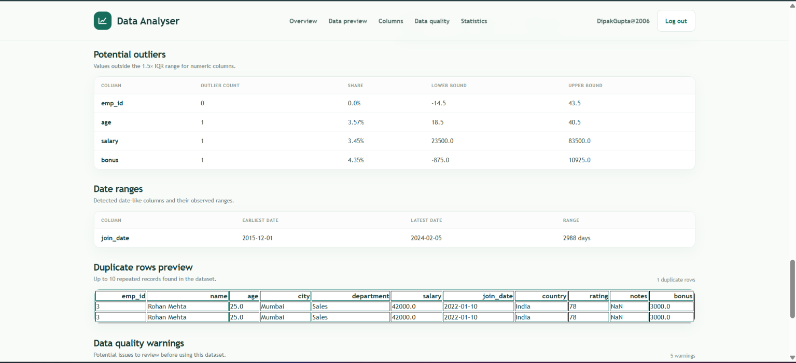 |

**Data quality warnings**

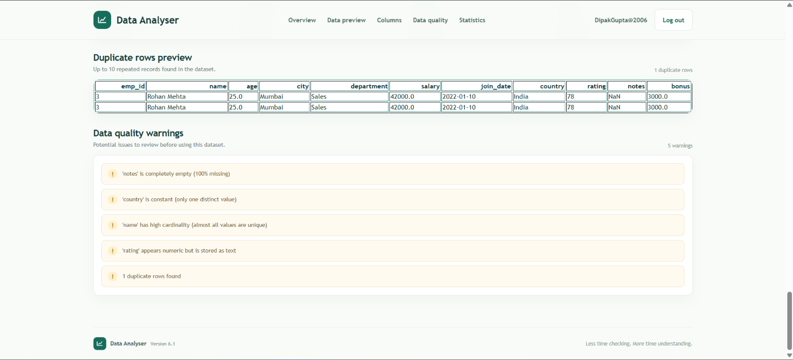

---

## ✨ Features

**Accounts**
- Register, login and logout with Django's built-in authentication
- Every user sees only their own files (all queries are filtered by `user`)

**File management**
- Upload `.csv`, `.xlsx` and `.json` files (max **15 MB**)
- Validation for file type, empty files and size limit
- Workspace table with file name, type, size and upload date
- Paginated data preview (50 rows per page) and delete with confirmation

**Analysis report**
- **Overview:** rows, columns, total cells, memory usage, missing values, duplicate rows
- **Data preview:** first and last records
- **Columns:** data types and unique counts
- **Data quality:** missing values per column with percentage bars
- **Statistics:** describe table, correlation matrix and skewness
- **Categories:** top 5 most frequent values for each text column
- **Outliers:** IQR-based detection with lower and upper bounds
- **Datetime columns:** automatic detection with min, max and range in days
- **Duplicate rows:** preview of repeated records
- **Smart warnings:** empty columns, >50% missing, constant columns, high cardinality, numbers stored as text, mixed types
- **Print report** button

**Robust file loading**
- Automatic delimiter detection for CSV (comma, semicolon and more)
- UTF-8 with automatic Latin-1 fallback
- JSON: plain lists or wrapped responses such as `{"status": "ok", "data": [...]}`; nested values are flattened
- Friendly error messages for empty, corrupted or unsupported files

---

## 🛠️ Tech Stack

| Layer | Technology |
|---|---|
| Backend | Python, Django 5.2 |
| Data processing | pandas, openpyxl |
| Database | SQLite (default) |
| Frontend | Django templates, custom HTML and CSS |

---

## 📁 Project Structure

```
Data Analyser/
├── manage.py
├── requirements.txt
├── core/                  # Project settings and root URLs
├── accounts/              # Landing, register, login, logout
│   ├── forms.py
│   ├── views.py
│   └── templates/accounts/
├── analyser/              # Upload, preview, analysis
│   ├── models.py          # Dataset model
│   ├── forms.py           # Upload validation
│   ├── views.py           # home, preview, analyze, delete
│   ├── services/
│   │   └── loader.py      # CSV / XLSX / JSON loading logic
│   ├── tests.py
│   └── templates/analyser/
├── docs/screenshots/
└── media/                 # Uploaded files (git-ignored)
```

---

## 🚀 Getting Started

### Prerequisites
- Python 3.10 or newer
- pip

### Installation

```bash
# 1. Clone the repository
git clone https://github.com/<your-username>/<your-repo>.git
cd <your-repo>

# 2. Create and activate a virtual environment
python -m venv venv
source venv/bin/activate        # Windows: venv\Scripts\activate

# 3. Install dependencies
pip install -r requirements.txt

# 4. Apply migrations
python manage.py migrate

# 5. Run the development server
python manage.py runserver
```

Open **http://127.0.0.1:8000/**, create an account and upload your first file.

### Run the tests

```bash
python manage.py test
```

The suite covers upload validation, data-quality warnings and corrupted-file handling.

---

## 🧭 How It Works

1. **Upload:** a file is validated and stored under `media/datasets/`.
2. **Load:** `services/loader.py` reads it into a pandas DataFrame (auto-detecting delimiter, encoding and JSON shape).
3. **Analyse:** the `analyze` view computes the statistics and warnings and renders `report.html`.

### URL routes

| Route | Description |
|---|---|
| `/` | Landing page |
| `/register/`, `/login/`, `/logout/` | Authentication |
| `/analyser/` | Workspace (upload and file list) |
| `/analyser/preview/<id>/` | Paginated data preview |
| `/analyser/analyze/<id>/` | Full analysis report |
| `/analyser/delete/<id>/` | Delete a dataset |

---

## 🗺️ Roadmap

- [ ] Interactive charts (histograms, missing-value chart)
- [ ] Delete and logout via POST requests
- [ ] Protected file downloads instead of public `/media/` URLs
- [ ] Decimal-comma support for semicolon CSV files
- [ ] Export report as PDF
- [ ] Environment-based settings (`SECRET_KEY`, `DEBUG`, `ALLOWED_HOSTS`) for deployment

---

## ⚠️ Notes

- This project is configured for **local development** (`DEBUG = True`). Move the secret key to environment variables and review Django's [deployment checklist](https://docs.djangoproject.com/en/5.2/howto/deployment/checklist/) before hosting it.
- Uploaded files are stored in `media/`, which is excluded from version control.

---

## 👤 Author

**Dipak Gupta**
B.Tech AI & Data Science, Thakur College of Engineering and Technology

---

## 📌 Version

**v6.1**
